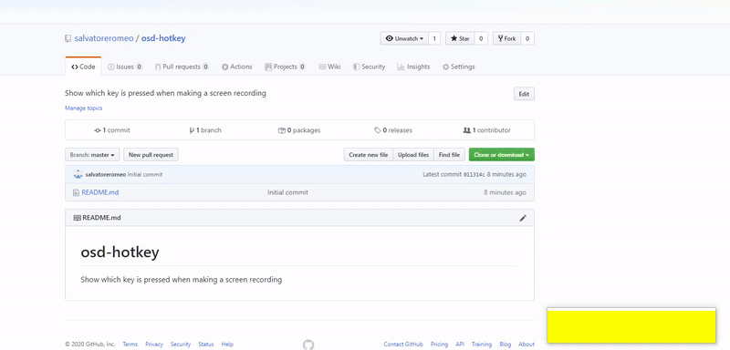
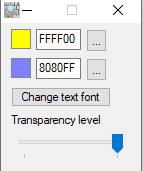

# osd-hotkey
Show which key is pressed when making a screen recording

##Download

[Download OsdHoteky v1.6](https://github.com/salvatoreromeo/osd-hotkey/blob/master/releases/osdhotkey%20v1.6.zip)

It's available for windows only.

Right click on the tray icon ofr options:

 

##For developers

This program is written in  [AutoHotkey]: https://www.autohotkey.com/

You can git clone and modify it as you want. 

If you have improvements, please send a pull request or send me an e-mail.

##License

MIT
